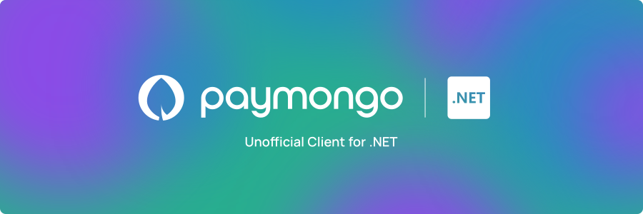

<a href="https://www.nuget.org/packages/Paymongo.Sharp">
    
</a>

<h2 align="center">Paymongo.Sharp - Unofficial .NET Client Wrapper for the Paymongo API</h2>

<p align="center">
    
    
    
    
</p>

<p style="text-align: justify">
Paymongo is a powerful payment platform that provides a wide range of payment solutions for businesses of all sizes. With the Paymongo API, you can integrate payment processing into your .NET applications, allowing you to securely accept payments, manage transactions, and more.

This client wrapper is designed to make it easy for .NET developers to interact with the Paymongo API. It provides a simple, intuitive interface that abstracts the API, allowing you to access a typed client and focus on building your Paymongo-integrated application faster.
</p>

> [!NOTE]  
> This is in it's early development stages and does not offer support for the whole
> Paymongo API.

## :arrow_down: Installation

Install package from: [Nuget](https://www.nuget.org/packages/Paymongo.Sharp/) using nuget cli or the nuget package manager.

#### Client usage

Add Imports

```csharp
using Paymongo.Sharp;
```

Initialize Client
```csharp
var client = new PaymongoClient(secretKey: "<secret_key>");
```

## :sparkles: What is currently Supported

This client is in active development, features are slowly being implemented but not all of them are supported as of now.
You can track the support for all of Paymongo's official API actions below:

### API Support

<table>
  <tr>
    <th>Resource</th>
    <th>API Version</th>
    <th>Support</th>
  </tr>
  <tr>
    <td>Checkout</td>
    <td>v1</td>
    <td>Full</td>
  </tr>
  <tr>
    <td>Payment Intent</td>
    <td>Not yet implemented</td>
    <td>Not yet implemented</td>
  </tr>
  <tr>
    <td>Payment Method</td>
    <td>Not yet implemented</td>
    <td>Not yet available</td>
  </tr>
  <tr>
    <td>Payments</td>
    <td>v1</td>
    <td>Partial</td>
  </tr>
  <tr>
    <td>Links</td>
    <td>Not yet implemented</td>
    <td>Not yet available</td>
  </tr>
  <tr>
    <td>Webhooks</td>
    <td>Not yet implemented</td>
    <td>Not yet available</td>
  </tr>
  <tr>
    <td>Customers</td>
    <td>Not yet implemented</td>
    <td>Not yet available</td>
  </tr>
</table>

---

### Checkout

- [x] Create Checkout Session
- [x] Retrieve a Checkout Session
- [x] Expire a Checkout Session

**Create a Checkout Session**

```csharp
// We create a new Checkout object
// This one includes the minimal required values
Checkout checkout = new Checkout() {
  Description = "Test Checkout",
    LineItems = new [] {
      new LineItem {
        Name = "item_name",
          Quantity = 1,
          Currency = Currency.Php,
          Amount = 3500
      }
    },
    PaymentMethodTypes = new [] {
      PaymentMethod.GCash,
        PaymentMethod.Card,
        PaymentMethod.Paymaya
    }
};

// We use the PaymongoClient from earlier
// This returns the Checkout object with the new server info for checkout url, id, and others
Checkout checkoutResult = await client.Checkouts.CreateCheckoutAsync(checkout);
```

**Retrieve a Checkout Session**

```csharp
// We use the PaymongoClient from earlier
// Lets assume that the checkout id is "12345678"
// This returns a Checkout object from the server
Checkout checkoutResult = await client.Checkouts.RetrieveCheckoutAsync("12345678");
```

**Expire a Checkout Session**

```csharp
// We use the PaymongoClient from earlier
// Lets assume that the checkout id is "12345678"
// This expires the checkout on the server and returns the expired Checkout object
Checkout checkoutResult = await client.Checkouts.ExpireCheckoutAsync("12345678");
```

For full Checkout API reference, please see: [Checkout Session Resource](https://developers.paymongo.com/reference/checkout-session-resource)

---

### Payment Intent

- [ ] Create Payment Intent
- [ ] Retrieve a Payment Intent
- [ ] Attach to a Payment Intent
- [ ] Attach to a Payment Intent

Pre Authorization and Capture

- [ ] Capture a Payment Intent
- [ ] Cancel a Payment Intent

For full Payment API reference, please see: [The Payment Intent Object](https://developers.paymongo.com/reference/the-payment-intent-object), [(Pre-Authorization) Capture](https://developers.paymongo.com/reference/capture-a-payment), [(Pre-Authorization) Cancel](https://developers.paymongo.com/reference/cancel-a-payment)

---

### Payment Method

- [ ] Retrieve list of possible merchant payment methods
- [ ] Create a payment method
- [ ] Retrieve a payment method
- [ ] Update a payment method

For full Payment Method API reference, please see: [The Payment Method Object](https://developers.paymongo.com/reference/the-payment-method-object)

---

### Payments

- [ ] Create a Payment
- [x] List all Payments
- [x] Retrieve a Payment

**List All Payments**

```csharp
// We use the PaymongoClient from earlier
// This returns a list of Payment objects
IEnumerable<Payment> paymentsResult = await client.Payments.ListAllPaymentsAsync();
```

**Retrieve a Payment**

```csharp
// We use the PaymongoClient from earlier
// Lets assume that the payment id is "12345678"
// This returns a Payment object from the server
Payment paymentResult = await client.Payments.RetrievePaymentAsync("12345678");
```

For full Payments API reference, please see: [Payment Resource](https://developers.paymongo.com/reference/payment-source)

---

### Links API

- [ ] Create a Link
- [ ] Retrieve a Link
- [ ] Get Link by Reference Number
- [ ] Archive a Link
- [ ] Unarchive a Link

For full Links API reference, please see: [Links Resource](https://developers.paymongo.com/reference/links-resource)

---

### Webhooks

- [ ] Create a Webhook
- [ ] List all Webhooks
- [ ] Retrieve a Webhook
- [ ] Disable a Webhook
- [ ] Enable a Webhook
- [ ] Update a Webhook

For full Webhook API reference, please see: [Webhook Resource](https://developers.paymongo.com/reference/webhook-resource)

---

### Refunds

- [ ] Create a Refund
- [ ] Retrieve a Refund
- [ ] List all Refunds

For full Refunds API reference, please see: [Refund Resource](https://developers.paymongo.com/reference/refund-resource)

---

### Customers

- [ ] Create a Customer
- [ ] Retrieve a Customer
- [ ] Edit a Customer
- [ ] Delete a Customer
- [ ] Retrieve the Payment Methods of a Customer
- [ ] Delete a Payment Method of a Customer

For full Customers API reference, please see: [Customer Resource](https://developers.paymongo.com/reference/customer-resource)

---

## :heart: Donate

This is free and available for everyone to use, but still requires time for development
and maintenance. By choosing to donate, you are not only helping develop this project,
but you are also helping me dedicate more time for creating more tools that help the community :heart:

## :tada: Special Thanks

This project is made easier to develop by Jetbrains! They have provided
Licenses to their IDE's to support development of this open-source project.

<a href="https://www.jetbrains.com/community/opensource/#support">

</a>
