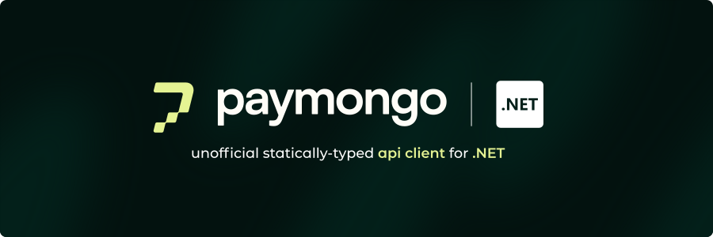

<a href="https://www.nuget.org/packages/Paymongo.Sharp">
    
</a>

<h2 align="center">Paymongo.Sharp - Effortless Paymongo integration for .NET</h2>

<p align="center">
    
    
    
    
    
</p>

<p style="text-align: justify">

[Paymongo](https://www.paymongo.com) is a powerful payment platform that provides a full suite of financial tools for businesses and more. With Paymongo.Sharp, you can integrate payment processing into your .NET applications, allowing you to securely accept payments, manage transactions, and more.
</p>

> [!IMPORTANT]  
> This client is not an official library by Paymongo. It is an independent open-source community project made to help .NET developers integrate Paymongo into their applications.

## :arrow_down: Installation

<br/>
<br/>
<div align="center">
    <a href="https://www.nuget.org/packages/Paymongo.Sharp/">
        
    </a>
    <p align="center">Install package from: <a href="https://www.nuget.org/packages/Paymongo.Sharp/">Nuget</a> using nuget cli or the nuget package manager.</p>
</div>
<br/>

Add Imports

```csharp
using Paymongo.Sharp;
```

Initialize Client
```csharp
var client = new PaymongoClient(apiKey: "<api_key or public_key>");
```

## :star: Payments Demo

**Cli (Console)**


**WPF (With WebView 2 Control)**


**Blazor**


This nuget package is not limited to these samples, it also supports the all .NET platforms including mono, android, and others.

## :sparkles: What API Actions are currently Supported

This client is in active development and features are slowly being implemented but not all of them are supported as of now.
You can track the support for all of Paymongo's official API actions below:

<table>
  <thead>
    <tr>
      <th></th>
      <th>API Resource</th>
      <th style="text-align:center;">Status</th>
    </tr>
  </thead>
  <tbody>
    <!-- Full Support -->
    <tr>
      <td>✅</td>
      <td>Checkout</td>
      <td style="text-align:center;"><b style="color:#e5f393;">Full</b></td>
    </tr>
    <tr>
      <td>✅</td>
      <td>Links</td>
      <td style="text-align:center;"><b style="color:#e5f393;">Full</b></td>
    </tr>
    <tr>
      <td>✅</td>
      <td>Payment Intent</td>
      <td style="text-align:center;"><b style="color:#e5f393;">Full</b></td>
    </tr>
    <tr>
      <td>✅</td>
      <td>Payment Method</td>
      <td style="text-align:center;"><b style="color:#e5f393;">Full</b></td>
    </tr>
    <tr>
      <td>✅</td>
      <td>Payments</td>
      <td style="text-align:center;"><b style="color:#e5f393;">Full</b></td>
    </tr>
    <tr>
      <td>✅</td>
      <td>Card Installments</td>
      <td style="text-align:center;"><b style="color:#e5f393;">Full</b></td>
    </tr>
    <tr>
      <td>✅</td>
      <td>Refunds</td>
      <td style="text-align:center;"><b style="color:#e5f393;">Full</b></td>
    </tr>
    <tr>
      <td>✅</td>
      <td>Sources</td>
      <td style="text-align:center;"><b style="color:#e5f393;">Full</b></td>
    </tr>
    <tr>
      <td>✅</td>
      <td>QR PH</td>
      <td style="text-align:center;"><b style="color:#e5f393;">Full</b></td>
    </tr>
    <tr>
      <td>✅</td>
      <td>Webhooks</td>
      <td style="text-align:center;"><b style="color:#e5f393;">Full</b></td>
    </tr>
    <!-- Partial Support -->
    <tr>
      <td>✅</td>
      <td>Customers</td>
      <td style="text-align:center;"><b style="color:#e5f393;">Full</b></td>
    </tr>
  </tbody>
</table>

## :collision: Breaking Changes (V2.0.0+)

Starting from this version, all resource object schemas have been changed to match the official Paymongo API documentation.

**v1.X.X - Old**
```csharp
Checkout checkout = new Checkout() {
    Description = "Test Checkout",
    LineItems = new [] {
        new LineItem {
            Name = "item_name",
            Quantity = 1,
            Currency = Currency.Php,
            Amount = 3500
        }
    },
    PaymentMethodTypes = new [] {
        PaymentMethod.GCash,
        PaymentMethod.Card,
        PaymentMethod.Paymaya
    }
};
```

**v2.X.X - Current**
```csharp
Checkout checkout = new Checkout() {
    Data = new CheckoutData() {
        Attributes = new CheckoutAttributes() {
            Description = "Test Checkout",
            LineItems = new [] {
                new LineItem {
                    Name = "item_name",
                    Quantity = 1,
                    Currency = Currency.Php,
                    Amount = 3500
                }
            },
            PaymentMethodTypes = new [] {
                PaymentMethodType.GCash,
                PaymentMethodType.Card,
                PaymentMethodType.Paymaya
            }
        }
    }
};
```

## :notebook: Basic Client API Reference

If you want to get started with this Paymongo client, you can
check the refernces for basic usage below.

### Checkout

- [x] Create Checkout Session
- [x] Retrieve a Checkout Session
- [x] Expire a Checkout Session

**Create a Checkout Session**

```csharp
// We create a new Checkout object
// This one includes the minimal required values
Checkout checkout = new Checkout() {
    Data = new CheckoutData() {
        Attributes = new CheckoutAttributes() {
            Description = "Test Checkout",
            LineItems = new [] {
                new LineItem {
                    Name = "item_name",
                    Quantity = 1,
                    Currency = Currency.Php,
                    Amount = 3500
                }
            },
            PaymentMethodTypes = new [] {
                PaymentMethodType.GCash,
                PaymentMethodType.Card,
                PaymentMethodType.Paymaya
            }
        }
    }
};

// We use the PaymongoClient from earlier
// This returns the Checkout object with the new server info for checkout url, id, and others
Checkout checkoutResult = await client.Checkouts.CreateCheckoutAsync(checkout);

// Optionally, you can provide an idempotency key to safely retry the request without creating duplicates
Checkout checkoutResultWithIdempotency = await client.Checkouts.CreateCheckoutAsync(checkout, "<idempotency-key>");
```

**Retrieve a Checkout Session**

```csharp
// We use the PaymongoClient from earlier
// Lets assume that the checkout id is "12345678"
// This returns a Checkout object from the server
Checkout checkoutResult = await client.Checkouts.RetrieveCheckoutAsync("12345678");
```

**Expire a Checkout Session**

```csharp
// We use the PaymongoClient from earlier
// Lets assume that the checkout id is "12345678"
// This expires the checkout on the server and returns the expired Checkout object
Checkout checkoutResult = await client.Checkouts.ExpireCheckoutAsync("12345678");
```

For full Checkout API reference, please see: [Checkout Session Resource](https://developers.paymongo.com/reference/checkout-session-resource)

### Payment Intent

- [x] Create Payment Intent
- [x] Retrieve a Payment Intent
- [x] Attach to a Payment Intent

**Create a Payment Intent**

```csharp
// Create a new PaymentIntent object with minimal required values
PaymentIntent paymentIntent = new PaymentIntent {
    Data = new PaymentIntentData {
        Attributes = new PaymentIntentAttributes {
            Amount = 10000,
            Currency = Currency.Php,
            PaymentMethodAllowed = new[] {
                PaymentMethodType.Card,
                PaymentMethodType.Paymaya
            },
            PaymentMethodOptions = new PaymentMethodOptions {
                Card = new CardOptions()
            }
        }
    }
};

// Use the PaymongoClient to create the payment intent
PaymentIntent paymentIntentResult = await client.PaymentIntents.CreatePaymentIntentAsync(paymentIntent);

// Optionally, you can provide an idempotency key to safely retry the request without creating duplicates
PaymentIntent paymentIntentResultWithIdempotency = await client.PaymentIntents.CreatePaymentIntentAsync(paymentIntent, "<idempotency-key>");
```

**Retrieve a Payment Intent**

```csharp
// Let's assume we have a payment intent id from the previous step
const string paymentIntentId = "pi_WENqK7d5L3XN9YQzEt39B3oF";

PaymentIntent getPaymentIntent = await client.PaymentIntents.RetrievePaymentIntentAsync(paymentIntentId);
```

**Attach to a Payment Intent**

```csharp
// Attach a payment method to an existing PaymentIntent
const string paymentIntentId = "pi_WENqK7d5L3XN9YQzEt39B3oF";

PaymentIntentAttachment paymentIntentAttachment = new PaymentIntentAttachment {
    Data = new PaymentIntentAttachmentData {
        Attributes = new PaymentIntentAttachmentAttributes {
            PaymentMethod = "pm_card_visa",
            ReturnUrl = "https://google.com"
        }
    }
};

PaymentIntent paymentIntentResult = await client.PaymentIntents.AttachToPaymentIntentAsync(paymentIntentId, paymentIntentAttachment);
```

For full Payment API reference, please see: [The Payment Intent Object](https://developers.paymongo.com/reference/the-payment-intent-object), [(Pre-Authorization) Capture](https://developers.paymongo.com/reference/capture-a-payment), [(Pre-Authorization) Cancel](https://developers.paymongo.com/reference/cancel-a-payment)

### Payment Method

- [x] Create a Payment Method
- [x] Retrieve a Payment Method
- [x] Update a Payment Method
- [x] Retrieve list of Payment Methods

**Create a Payment Method**

```csharp
// We create a new PaymentMethod object
PaymentMethod paymentMethod = new PaymentMethod {
    Data = new PaymentMethodData {
        Attributes = new PaymentMethodAttributes {
            Type = PaymentMethodType.GCash,
            Billing = new Billing {
                Name = "Test Name",
                Email = "test@paymongo.com",
                Phone = "+639123456789",
                Address = new Address {
                    Line1 = "Test Address 1",
                    Line2 = "Test Address 2",
                    PostalCode = "1234",
                    State = "Test State",
                    City = "Test City",
                    Country = "PH"
                }
            }
        }
    }
};

// Use the PaymongoClient from earlier
PaymentMethod paymentMethodResult = await client.PaymentMethods.CreatePaymentMethodAsync(paymentMethod);

// Optionally, you can provide an idempotency key to safely retry the request without creating duplicates
PaymentMethod paymentMethodResultWithIdempotency = await client.PaymentMethods.CreatePaymentMethodAsync(paymentMethod, "<idempotency-key>");
```

**Retrieve a Payment Method**

```csharp
// Use the PaymongoClient from earlier
// Let's assume the payment method id is "pm_12345678"
PaymentMethod paymentMethodResult = await client.PaymentMethods.RetrievePaymentMethodAsync("pm_12345678");
```

**Update a Payment Method**

```csharp
// Retrieve the payment method first
PaymentMethod paymentMethodResult = await client.PaymentMethods.RetrievePaymentMethodAsync("pm_12345678");

// Update properties as needed
paymentMethodResult.Data.Attributes.Cvc = "424";

// Update the payment method on the server
PaymentMethod updatedPaymentMethodResult = await client.PaymentMethods.UpdatePaymentMethodAsync(paymentMethodResult);
```

**Retrieve list of Payment Methods**

```csharp
// Use the PaymongoClient from earlier
IEnumerable<PaymentMethod> paymentMethods = await client.PaymentMethods.RetrievePaymentMethodsAsync();
```

For full Payment Method API reference, please see: [The Payment Method Object](https://developers.paymongo.com/reference/the-payment-method-object)

### Payments

- [x] Create a Payment
- [x] List all Payments
- [x] Retrieve a Payment

**List All Payments**

```csharp
// We use the PaymongoClient from earlier
// This returns a list of Payment objects
IEnumerable<Payment> paymentsResult = await client.Payments.ListAllPaymentsAsync();
```

**Retrieve a Payment**

```csharp
// We use the PaymongoClient from earlier
// Lets assume that the payment id is "12345678"
// This returns a Payment object from the server
Payment paymentResult = await client.Payments.RetrievePaymentAsync("12345678");
```

**Create a Payment**

```csharp
// We create a new Payment object
Payment payment = new Payment() {
    Data = new PaymentData() {
        Attributes = new PaymentAttributes() {
            Amount = 10000,
            Currency = Currency.Php,
            PaymentMethod = "pm_card_visa",
            Description = "Test Payment"
        }
    }
};

// Use the PaymongoClient from earlier
Payment paymentResult = await client.Payments.CreatePaymentAsync(payment);

// Optionally, you can provide an idempotency key to safely retry the request without creating duplicates
Payment paymentResultWithIdempotency = await client.Payments.CreatePaymentAsync(payment, "<idempotency-key>");
```

For full Payments API reference, please see: [Payment Resource](https://developers.paymongo.com/reference/payment-source)

### Links

- [x] Create a Link
- [x] Retrieve a Link
- [x] ~~Get Link by Reference Number~~ (Deprecated)
- [x] Archive a Link
- [x] Unarchive a Link

**Create a Link**

```csharp
// We create a new Link object
// This one includes the minimal required values
Link link = new Link {
    Data = new LinkData {
        Attributes = new LinkAttributes {
            Description = "New Link",
            Amount = 100000,
            Currency = Currency.Php
        }
    }
};

// We use the PaymongoClient from earlier
// This returns the Link object with the new server info for checkout url, id, and others
Link linkResult = await client.Links.CreateLinkAsync(link);

// Optionally, you can provide an idempotency key to safely retry the request without creating duplicates
Link linkResultWithIdempotency = await client.Links.CreateLinkAsync(link, "<idempotency-key>");
```

**Retrieve a Link**

```csharp
// We use the PaymongoClient from earlier
// Lets assume that the link id is "12345678"
// This returns a Link object from the server
Link linkResult = await client.Links.RetrieveLinkAsync("12345678");
```

**~~Get Link by Reference Number~~ (Deprecated)**

```csharp
// We use the PaymongoClient from earlier
// Lets assume that the link id is "ABCD1234"
// This returns a Link object from the server
Link linkResult = await client.Links.GetLinkByReferenceNumberAsync("ABCD1234");
```

**Archive a Link**

```csharp
// We use the PaymongoClient from earlier
// Lets assume that the Link id is "12345678"
// This returns the updated archived Link object
Link linkResult = await client.Links.ArchiveLinkAsync("12345678");
```

**Unarchive a Link**

```csharp
// We use the PaymongoClient from earlier
// Lets assume that the payment id is "12345678"
// This returns the updated un-archived Link object
Link linkResult = await client.Links.UnarchiveLinkAsync("12345678");
```

For full Links API reference, please see: [Links Resource](https://developers.paymongo.com/reference/links-resource)

### Webhooks

- [x] Create a Webhook
- [x] List all Webhooks
- [x] Retrieve a Webhook
- [x] Disable a Webhook
- [x] Enable a Webhook
- [x] Update a Webhook

**Create a Webhook**

```csharp
// Create a new Webhook object with required values
Webhook webhook = new Webhook {
    Data = new WebhookData {
        Attributes = new WebhookAttributes {
            Url = "https://www.example.com/webhook",
            Events = new[] { "source.chargeable", "payment.paid" }
        }
    }
};

// Use the PaymongoClient to create the webhook
Webhook created = await client.Webhooks.CreateWebhookAsync(webhook);

// Optionally, you can provide an idempotency key to safely retry the request without creating duplicates
Webhook createdWithIdempotency = await client.Webhooks.CreateWebhookAsync(webhook, "<idempotency-key>");
```

**Retrieve a Webhook**

```csharp
// Retrieve a webhook by its ID
Webhook retrieved = await client.Webhooks.RetrieveWebhookAsync("wh_12345678");
```

**List Webhooks**

```csharp
// List all webhooks
IEnumerable<Webhook> webhooks = await client.Webhooks.ListWebhooksAsync();
```

**Update a Webhook**

```csharp
// Update an existing webhook's URL
Webhook webhook = await client.Webhooks.RetrieveWebhookAsync("wh_12345678");
webhook.Data.Attributes.Url = "https://www.example.com/updated";
Webhook updated = await client.Webhooks.UpdateWebhookAsync(webhook);
```

**Enable a Webhook**

```csharp
// Enable a webhook by its ID
Webhook enabled = await client.Webhooks.EnableWebhookAsync("wh_12345678");
```

**Disable a Webhook**

```csharp
// Disable a webhook by its ID
Webhook disabled = await client.Webhooks.DisableWebhookAsync("wh_12345678");
```

For full Webhook API reference, please see: [Webhook Resource](https://developers.paymongo.com/reference/webhook-resource)

### Refunds

- [x] Create a Refund
- [x] Retrieve a Refund
- [x] List all Refunds

**Create a Refund**

```csharp
// Create a new Refund object with the minimal required values
Refund refund = new Refund {
    Data = new RefundData {
        Attributes = new RefundAttributes {
            Amount = 10000,
            PaymentId = "payment_id_12345678",
            Currency = Currency.Php,
            Notes = "Test refund"
        }
    }
};

// Use the PaymongoClient from earlier
// This returns the Refund object with server info
Refund refundResult = await client.Refunds.CreateRefundAsync(refund);

// Optionally, you can provide an idempotency key to safely retry the request without creating duplicates
Refund refundResultWithIdempotency = await client.Refunds.CreateRefundAsync(refund, "<idempotency-key>");
```

**Retrieve a Refund**

```csharp
// Use the PaymongoClient from earlier
// Assume the refund id is "refund_id_12345678"
// This returns a Refund object from the server
Refund refundResult = await client.Refunds.RetrieveRefundAsync("refund_id_12345678");
```

**List All Refunds**

```csharp
// Use the PaymongoClient from earlier
// Optionally filter by payment id and set a limit
IEnumerable<Refund> refunds = await client.Refunds.ListAllRefundsAsync(paymentId: "payment_id_12345678", limit: 10);
```

For full Refunds API reference, please see: [Refund Resource](https://developers.paymongo.com/reference/refund-resource)

### Customers

- [x] Create a Customer
- [x] Retrieve a Customer
- [x] Edit a Customer
- [x] Delete a Customer

**Create a Customer**

```csharp
// We create a new Customer object
// This one includes the minimal required values
Customer customer = new Customer {
    Data = new CustomerData {
        Attributes = new CustomerAttributes {
            FirstName = "First Name",
            LastName = "Last Name",
            Email = "testcustomermail@mail.com",
            Phone = "+639234735258",
            DefaultDevice = Device.Email
        }
    }
};

// We use the PaymongoClient from earlier
// This returns a Customer object from the server with an Id as confirmation
Customer customerResult = await client.Customers.CreateCustomerAsync(customer);

// Optionally, you can provide an idempotency key to safely retry the request without creating duplicates
Customer customerResultWithIdempotency = await client.Customers.CreateCustomerAsync(customer, "<idempotency-key>");
```

**Retrieve a Customer**

```csharp
// We use the PaymongoClient from earlier
// Lets assume that the customer email is "customer@mail.com"
// Lets assume that the customer phone number is "+639876543210"
// This returns a Customer object from the server
Customer customerResult = await client.Customers.RetrieveCustomerAsync("customer@mail.com", "+639876543210");
```

**Edit a Customer**

```csharp
// First lets get the customer we want to edit
Customer customerResult = await client.Customers.RetrieveCustomerAsync("customer@mail.com", "+639876543210");

// Lets edit some of the customer information
customerResult.Data.Attributes.FirstName = "New First Name";
customerResult.Data.Attributes.LastName = "New Last Name";

// After this update executes, this returns the Customer object with the updated information
var editCustomerResult = await client.Customers.EditCustomerAsync(customerResult);

```

**Delete a Customer**

```csharp
// We use the PaymongoClient from earlier
// Lets assume that the customer id is "12345678"
// This returns true if the customer is deleted successfuly
bool deletedCustomerResult = await client.Customers.DeleteCustomerAsync("12345678");
```

For full Customers API reference, please see: [Customer Resource](https://developers.paymongo.com/reference/customer-resource)

### Sources (GCash and GrabPay Checkout) (No longer [supported](https://developers.paymongo.com/reference/the-sources-object))

- [x] Create a Source
- [x] Retrieve a Source

**Create a Source**

```csharp
// We create a new Source object
// This one includes the minimal required values
Source source = new Source {
    Data = new SourceData {
        Attributes = new SourceAttributes {
            Amount = 100000,
            Billing = new Billing {
                Name = "TestName",
                Email = "test@paymongo.com",
                Phone = "9734534443",
                Address = new Address {
                    Line1 = "TestAddress1",
                    Line2 = "TestAddress2",
                    PostalCode = "4506",
                    State = "TestState",
                    City = "TestCity",
                    Country = "PH"
                }
            },
            Redirect = new Redirect {
                Success = "http://127.0.0.1",
                Failed = "http://127.0.0.1"
            },
            Type = SourceType.GCash,
            Currency = Currency.Php
        }
    }
};

// We use the PaymongoClient from earlier
// This returns a Source object from the server
// containing the redirect object(with checkout url) and other info
Source sourceResult = await client.Sources.CreateSourceAsync(source);

// Optionally, you can provide an idempotency key to safely retry the request without creating duplicates
Source sourceResultWithIdempotency = await client.Sources.CreateSourceAsync(source, "<idempotency-key>");
```

**Retrieve a Source**

```csharp
// We use the PaymongoClient from earlier
// Lets assume that the Source id is "12345678"
// This returns a Source object from the server
Link sourceResult = await client.Sources.RetrieveSourceAsync("12345678");
```

For full Sources API reference, please see: [The Sources Object](https://developers.paymongo.com/reference/the-sources-object)

### Installments

- [x] List Installment Plans

**List Card Installment Plans**

```csharp
// We use the PaymongoClient from earlier
// Let's assume the amount is 100000 (in centavos)
// This returns a list of available InstallmentPlan objects for the given amount
IEnumerable<InstallmentPlan> plans = await client.CardInstallments.ListInstallmentPlansAsync(100000);
```

For full Installments API reference, please see: [List Installment Plans](https://developers.paymongo.com/reference/list-installment-plans)

### QR PH

- [x] Create a Static QR PH Code

**Create a Static QR PH Code**

```csharp
// We create a new QrPhCode object
// This one includes the minimal required values
QrPhCode qrPh = new QrPhCode {
    Data = new QrPhCodeData {
        Attributes = new QrPhCodeAttributes {
            MobileNumber = "+639123456789",
            Kind = QrCodeKind.Instore
        }
    }
};

// We use the PaymongoClient from earlier
// This returns a Source object from the server
// containing the redirect object(with checkout url) and other info
QrPhCode qrPhResult = await client.QrPh.CreateStaticQrPhCodeAsync(qrPh);

// Optionally, you can provide an idempotency key to safely retry the request without creating duplicates
QrPhCode qrPhResultWithIdempotency = await client.QrPh.CreateStaticQrPhCodeAsync(qrPh, "<idempotency-key>");
```

For full QR PH API reference, please see: [Create a Static QR PH Code](https://developers.paymongo.com/reference/create-a-static-qr-ph-code)

### Other Plans

What do you think should be implemented in future versions of the client? Let your ideas be known
and open an [issue](https://github.com/russkyc/paymongo-sharp/issues) with a [feature-request] tag and it might make it into future updates.
Or, if you tried something that works and is awesome try opening a [pull request](https://github.com/russkyc/paymongo-sharp/pulls) and if all
is good, your contribution can be implemented into the project!

## :heart: Donate

This is free and available for everyone to use, but still requires time for development
and maintenance. By choosing to donate, you are not only helping develop this project,
but you are also helping me dedicate more time for creating more tools that help the community :heart:

## :tada: Special Thanks

This project is made easier to develop by Jetbrains! They have provided
Licenses to their IDE's to support development of this open-source project.

<a href="https://www.jetbrains.com/community/opensource/#support">

</a>
